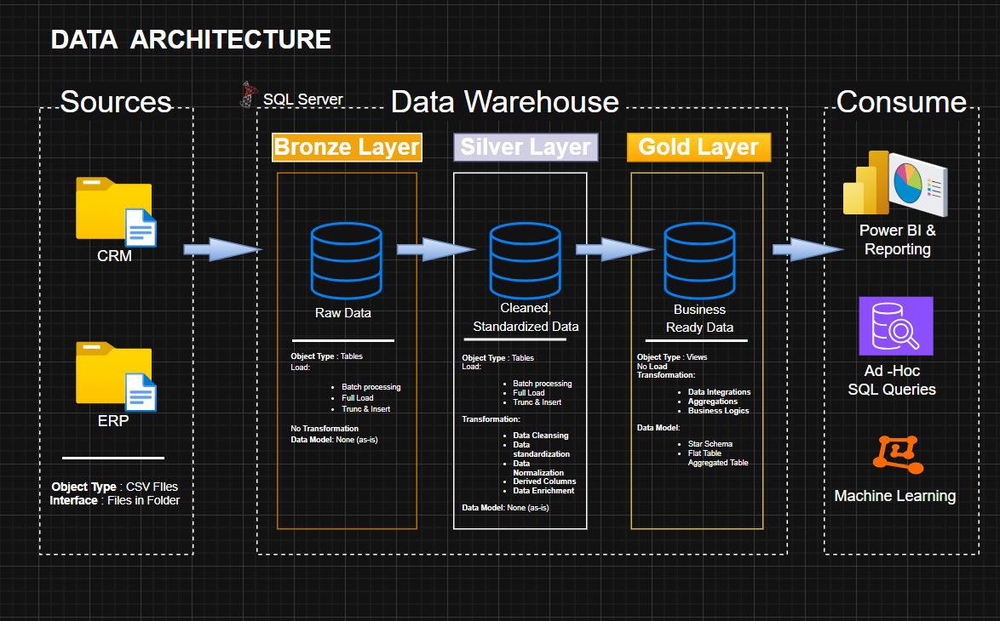
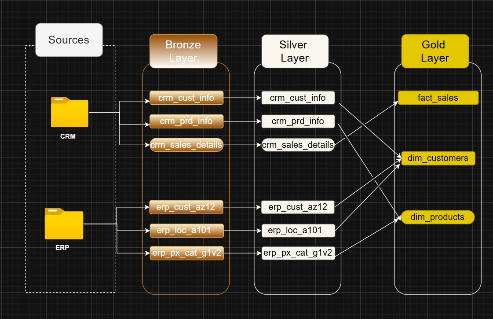
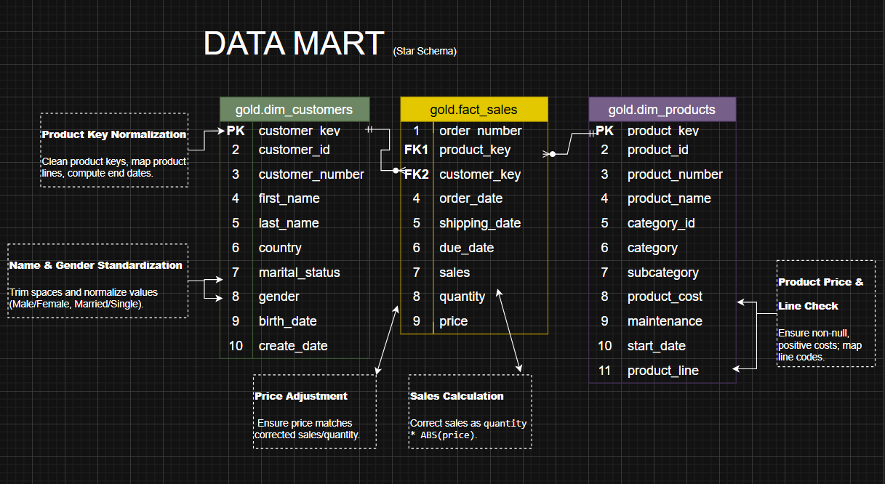

# SQL_Datawarehouse_Projects
Building a modern data warehouse with SQL Server, including ETL processes, data modeling, and analytics

# Data Warehouse and Analytics Project

Welcome to the **Data Warehouse and Analytics Project** repository! 🚀  
This project demonstrates a comprehensive data warehousing and analytics solution, from building a data warehouse to generating actionable insights. Designed as a portfolio project, it highlights industry best practices in data engineering and analytics.

---
## 🏗️ Data Architecture

The data architecture for this project follows Medallion Architecture **Bronze**, **Silver**, and **Gold** layers:  

1. **Bronze Layer**: Stores raw data as-is from the source systems. Data is ingested from CSV Files into SQL Server Database.
2. **Silver Layer**: This layer includes data cleansing, standardization, and normalization processes to prepare data for analysis.
3. **Gold Layer**: Houses business-ready data modeled into a star schema required for reporting and analytics.

---
## 📊 Data Flow

The flow of data through the ETL pipelines and across layers is structured to ensure data integrity and accessibility:  

---
## 🔗 Data Integration Model

This project employs a robust data integration model to consolidate multiple sources into a coherent analytical framework:  

---
## 📖 Project Overview

This project involves:

1. **Data Architecture**: Designing a Modern Data Warehouse Using Medallion Architecture **Bronze**, **Silver**, and **Gold** layers.
2. **ETL Pipelines**: Extracting, transforming, and loading data from source systems into the warehouse.
3. **Data Modeling**: Developing fact and dimension tables optimized for analytical queries.
4. **Analytics & Reporting**: Creating SQL-based reports and dashboards for actionable insights.

🎯 This repository is an excellent resource for professionals and students looking to showcase expertise in:
- SQL Development
- Data Architect
- Data Engineering  
- ETL Pipeline Developer  
- Data Modeling  
- Data Analytics  

---
## 🛠️ DATA MART (Star Schema)

The star schema is implemented to optimize analytical queries and reporting efficiency:  

---
## 🚀 Project Requirements

### Building the Data Warehouse (Data Engineering)

#### Objective
Develop a modern data warehouse using SQL Server to consolidate sales data, enabling analytical reporting and informed decision-making.

#### Specifications
- **Data Sources**: Import data from two source systems (ERP and CRM) provided as CSV files.
- **Data Quality**: Cleanse and resolve data quality issues prior to analysis.
- **Integration**: Combine both sources into a single, user-friendly data model designed for analytical queries.
- **Scope**: Focus on the latest dataset only; historization of data is not required.
- **Documentation**: Provide clear documentation of the data model to support both business stakeholders and analytics teams.

---
### BI: Analytics & Reporting (Data Analysis)

#### Objective
Develop SQL-based analytics to deliver detailed insights into:
- **Customer Behavior**
- **Product Performance**
- **Sales Trends**

These insights empower stakeholders with key business metrics, enabling strategic decision-making.  

## 📂 Repository Structure

data-warehouse-project/
│
├── datasets/ # Raw datasets used for the project (ERP and CRM data)
│
├── docs/ # Project documentation and architecture details
│ ├── etl.drawio # Draw.io file shows all different techniques and methods of ETL
│ ├── data_architecture.drawio # Draw.io file shows the project's architecture
│ ├── data_catalog.md # Catalog of datasets, including field descriptions and metadata
│ ├── data_flow.drawio # Draw.io file for the data flow diagram
│ ├── data_models.drawio # Draw.io file for data models (star schema)
│ ├── naming-conventions.md # Consistent naming guidelines for tables, columns, and files
│
├── scripts/ # SQL scripts for ETL and transformations
│ ├── bronze/ # Scripts for extracting and loading raw data
│ ├── silver/ # Scripts for cleaning and transforming data
│ ├── gold/ # Scripts for creating analytical models
│
├── tests/ # Test scripts and quality files
│
├── README.md # Project overview and instructions
├── LICENSE # License information for the repository
├── .gitignore # Files and directories to be ignored by Git
└── requirements.txt # Dependencies and requirements for the project

---

## 🛡️ License

This project is licensed under the [MIT License](LICENSE). You are free to use, modify, and share this project with proper attribution.

## 🌟 About Me

Hi, I'm **Ayush Ranabhat**. I’m an aspiring data analyst with a background in finance and experience working with data in banking and clerical roles. Right now, I’m learning on my own and building a data warehouse project to sharpen my skills and understand data systems more deeply. If you notice anything that can be improved in this project, feel free to let me know. A quick thanks to Baraa for the inspiration and support.

## Let's stay in touch

